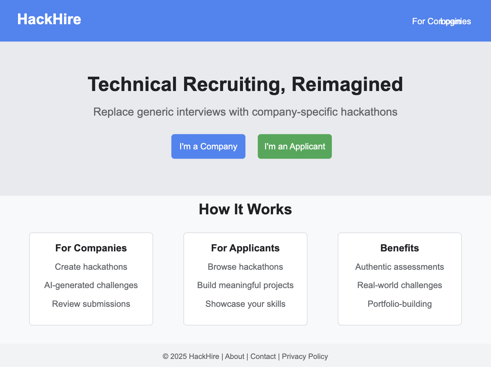
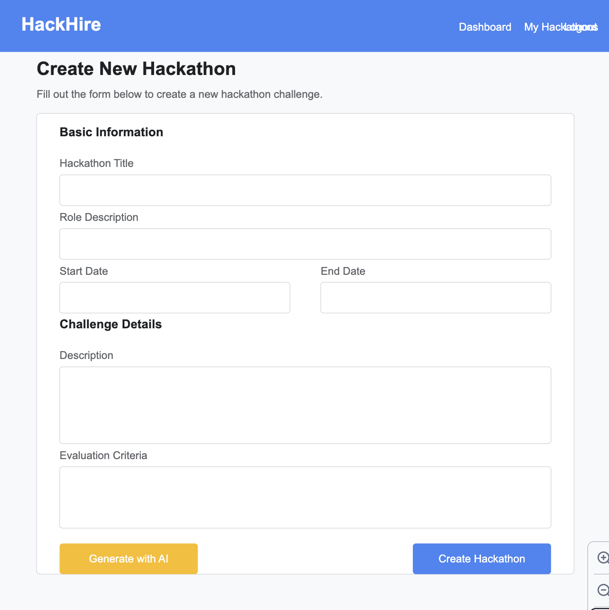
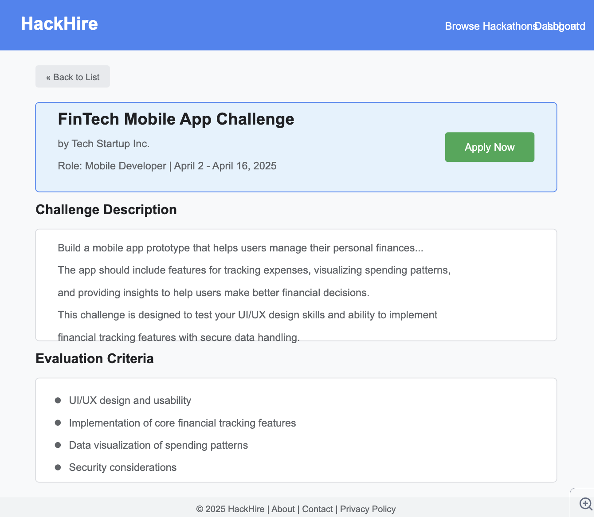
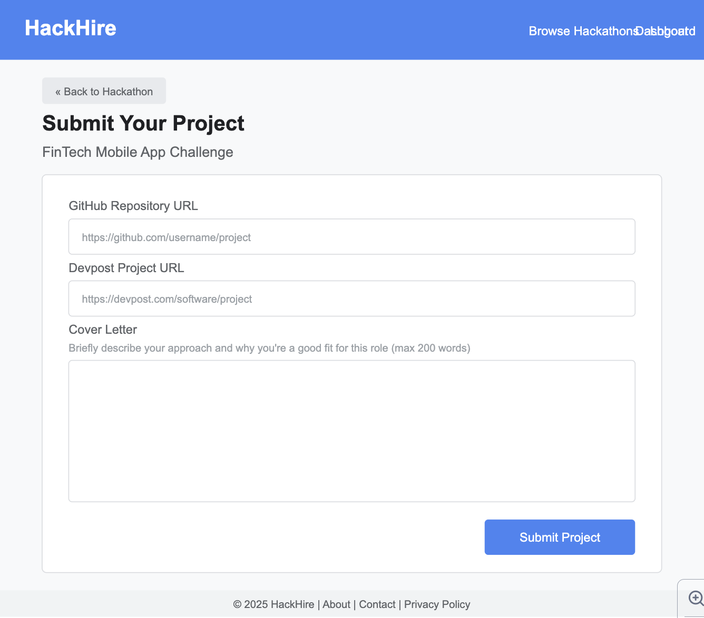
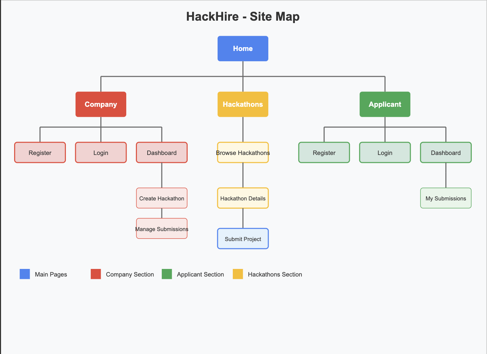

# HackHire

## Overview

HackHire is a web application that revolutionizes technical recruiting for small companies by replacing generic interviews with company-specific virtual hackathons. Companies can create customized hackathon challenges tailored to their industry, products, and open roles through AI-generated prompts based on a simple onboarding questionnaire. These challenges are designed to be meaningful projects that benefit applicants regardless of hiring outcomes.

On the company side, HackHire allows employers to create, manage, and track hackathon challenges while reviewing submitted projects and applications. On the applicant side, users can browse active hackathons, register for challenges that match their interests and skills, and submit their completed projects along with a brief cover letter. This approach creates a more authentic assessment process that evaluates candidates based on relevant, practical skills while providing value to all participants.

## Data Model

The application will store Users (both Companies and Applicants), Hackathons, and Submissions.

* Companies can have multiple hackathons (via references)
* Each hackathon can have multiple submissions (via references)
* Applicants can participate in multiple hackathons (via references)

An Example Company User:

```javascript
{
  username: "techstartup",
  companyName: "Tech Startup Inc.",
  email: "recruit@techstartup.com",
  hash: // a password hash,
  industry: "FinTech",
  companySize: "25-50",
  companyDescription: "We're building the future of financial technology...",
  hackathons: // an array of references to Hackathon documents
}
```

An Example Applicant User:

```javascript
{
  username: "codergirl",
  firstName: "Jane",
  lastName: "Doe",
  email: "jane@example.com",
  hash: // a password hash,
  skills: ["JavaScript", "React", "Node.js"],
  githubProfile: "https://github.com/codergirl",
  submissions: // an array of references to Submission documents
}
```

An Example Hackathon:

```javascript
{
  company: // a reference to a Company User object
  title: "FinTech Mobile App Challenge",
  description: "Build a mobile app prototype that helps users manage their personal finances...",
  evaluationCriteria: [
    "UI/UX design and usability",
    "Implementation of core financial tracking features",
    "Data visualization of spending patterns",
    "Security considerations"
  ],
  roleDescription: "Mobile Developer",
  startDate: // timestamp,
  endDate: // timestamp,
  isActive: true,
  submissions: // an array of references to Submission documents
}
```

An Example Submission:

```javascript
{
  hackathon: // a reference to a Hackathon object,
  applicant: // a reference to an Applicant User object,
  githubLink: "https://github.com/codergirl/fintech-app",
  devpostLink: "https://devpost.com/software/fintech-budget-app",
  coverLetter: "I'm excited to apply for this role because...",
  submissionDate: // timestamp,
  status: "submitted" // or "reviewed", "shortlisted", etc.
}
```

## [Link to Commented First Draft Schema](db.mjs) 

## Wireframes






## Site map



## User Stories or Use Cases

1. As a company, I can register for an account to create hackathons
2. As a company, I can log in to access my dashboard
3. As a company, I can fill out an onboarding form to generate a custom hackathon prompt
4. As a company, I can create and publish a new hackathon with AI-generated prompt and evaluation criteria
5. As a company, I can view all my active and past hackathons
6. As a company, I can track submissions for each hackathon
7. As a company, I can review submitted projects with their GitHub and Devpost links
8. As an applicant, I can register for an account to participate in hackathons
9. As an applicant, I can log in to access my dashboard
10. As an applicant, I can browse available hackathons from different companies
11. As an applicant, I can register for a hackathon before its deadline
12. As an applicant, I can submit my project with GitHub and Devpost links
13. As an applicant, I can include a brief cover letter with my submission
14. As an applicant, I can view my past hackathon participations and submissions

## Research Topics

* (5 points) Integrate user authentication
  * Will implement user authentication with distinct roles for companies and applicants
  * Will use Passport.js for authentication handling
  * Will implement proper registration, login, and session management
  * Will ensure secure password storage and validation

* (3 points) External API integration
  * Will integrate with OpenAI API to generate custom hackathon prompts
  * The API will take company information and role requirements to create relevant challenges
  * Will implement proper error handling and fallbacks for API calls
  * Will ensure secure handling of API keys through environment variables

* (2 points) Use a CSS framework
  * Will use Tailwind CSS for responsive design and component styling
  * Will customize the theme to create a distinct brand identity
  * Will ensure mobile-first design principles throughout the application

10 points total out of 8 required points

## [Link to Initial Main Project File](app.mjs) 

## Annotations / References Used

(Will be added as development progresses)